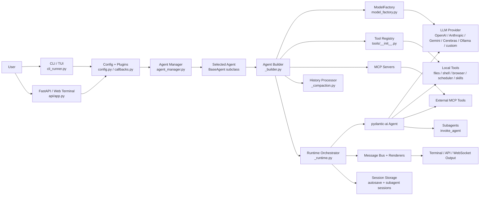
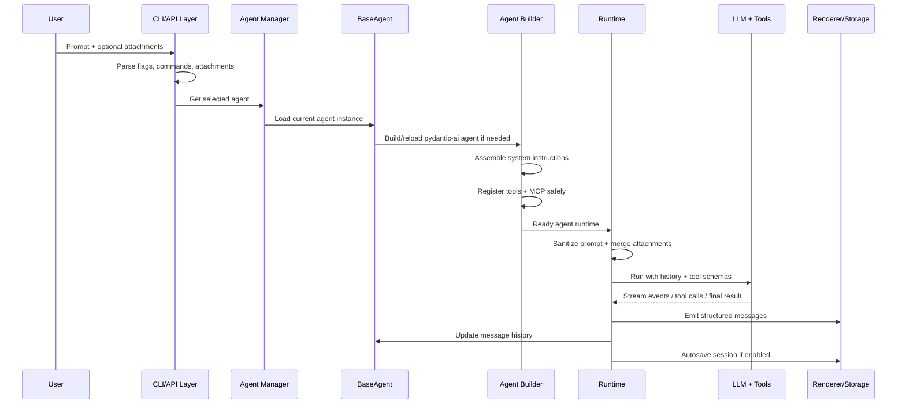
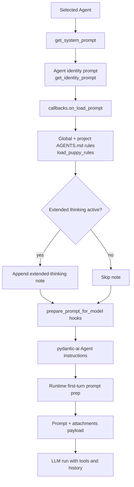
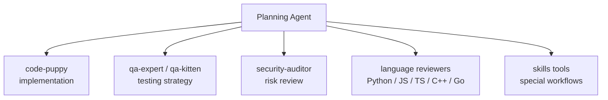
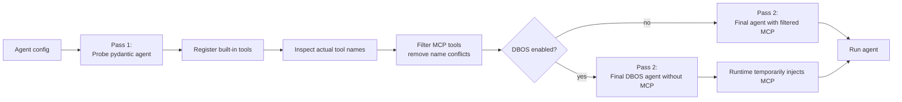
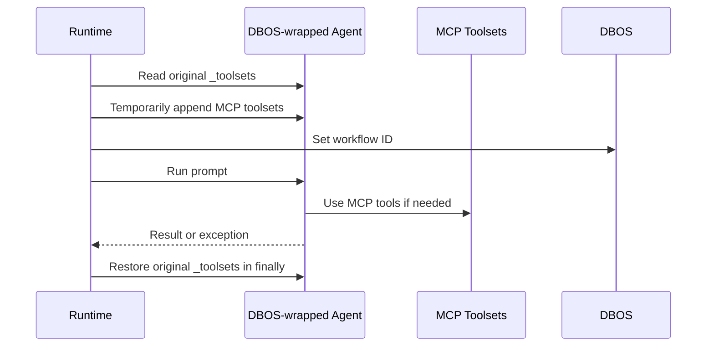
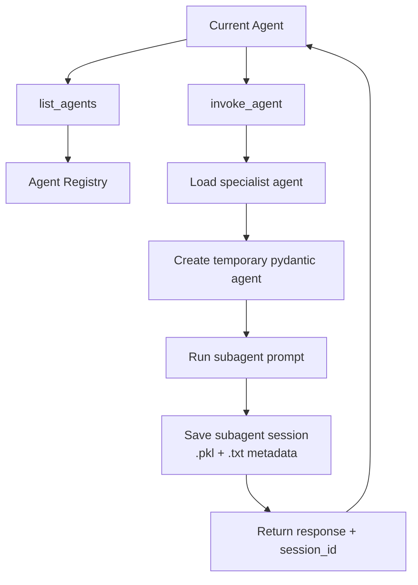
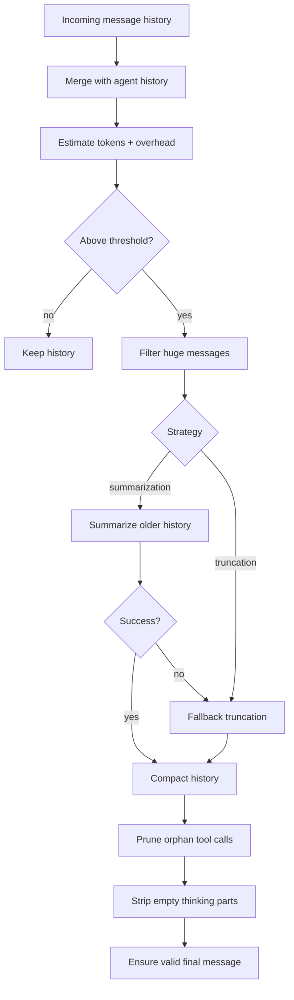

# Code Puppy — App Analysis, Internal Prompt Flow, and Unique Design Findings

Generated from the uploaded archive: `code_puppy-main.zip`.

This report summarizes what I found while inspecting the app source. It focuses on how Code Puppy works internally, why its planning behavior feels unusually strong, how the internal system prompt is assembled, and which architectural choices look unique or especially thoughtful.

> Scope note: I inspected the source code and documentation inside the uploaded project. I did not run the full application or execute its test suite. Source references below are local repository paths from the extracted archive.

---

## 1. Executive Summary

Code Puppy is a **CLI-first AI coding agent** with an optional **FastAPI + WebSocket API layer**. It is built around `pydantic-ai`, a modular agent registry, a tool registry, MCP server support, optional DBOS durable execution, session persistence, and a plugin/callback system.

The app does not simply send a user message to a model. It builds a controlled agent runtime:

```text
User prompt
  + selected agent identity
  + agent-specific system prompt
  + project/global AGENTS.md rules
  + callback/plugin prompt additions
  + model-specific prompt preparation
  + model reasoning settings
  + tool schemas
  + message history processor
  + optional MCP tools
  + optional DBOS wrapper
  => pydantic-ai Agent
  => model/tool execution loop
  => rendered response + persisted history
```

The reason Code Puppy feels especially good at planning is that it combines:

- a dedicated **Planning Agent** with a strong planning prompt,
- mandatory project exploration tools,
- structured roadmap output,
- subagent delegation,
- long-context history compaction,
- model-specific reasoning settings,
- project rule injection from `AGENTS.md`, and
- a tool-first “think → inspect → act → test” coding loop.

The most unique design I found is the **conflict-safe two-pass agent build** in `code_puppy/agents/_builder.py`: the app first builds a probe agent, registers local tools, inspects tool names, filters conflicting MCP tools, and then builds the final agent. In DBOS mode, MCP tools are not attached during construction because DBOS cannot safely pickle some async generator toolsets; instead, MCP toolsets are temporarily injected at runtime and restored afterward.

---

## 2. High-Level App Architecture

Source references:

- `code_puppy/__main__.py`
- `code_puppy/main.py`
- `code_puppy/cli_runner.py`
- `code_puppy/api/app.py`
- `code_puppy/api/main.py`
- `code_puppy/api/websocket.py`
- `code_puppy/agents/base_agent.py`
- `code_puppy/agents/_builder.py`
- `code_puppy/agents/_runtime.py`
- `code_puppy/model_factory.py`
- `code_puppy/tools/__init__.py`
- `code_puppy/session_storage.py`



### Main entry points

The CLI entry chain is simple:

```text
python -m code_puppy
  -> code_puppy/__main__.py
  -> code_puppy/main.py
  -> code_puppy/cli_runner.py:main_entry()
```

The API entry chain is separate:

```text
code_puppy/api/main.py
  -> create_app()
  -> FastAPI routers + WebSocket endpoints
```

The app is therefore not a single monolithic agent. It is a small runtime platform for agents, tools, models, sessions, plugins, and user interfaces.

---

## 3. Typical Prompt Lifecycle

Source references:

- `code_puppy/cli_runner.py`
- `code_puppy/agents/base_agent.py`
- `code_puppy/agents/_builder.py`
- `code_puppy/agents/_runtime.py`
- `code_puppy/model_utils.py`
- `code_puppy/tools/__init__.py`
- `code_puppy/messaging/*`



The important part is that a prompt does not go directly to the model. It passes through configuration, agent selection, prompt assembly, tool registration, model-specific adaptation, history processing, and runtime orchestration.

---

## 4. How the Internal System Prompt Works

Source references:

- `code_puppy/agents/base_agent.py`
- `code_puppy/agents/agent_code_puppy.py`
- `code_puppy/agents/agent_planning.py`
- `code_puppy/agents/_builder.py`
- `code_puppy/agents/_runtime.py`
- `code_puppy/model_utils.py`
- `code_puppy/tools/__init__.py`
- `code_puppy/callbacks.py`

### Prompt assembly pipeline



### What gets included

The final instructions are assembled from several layers:

| Layer | What it contributes | Source |
|---|---|---|
| Agent system prompt | Role, behavior, tool policy, output format | `agents/agent_*.py` |
| Identity prompt | Unique agent ID like `agent-name-abc123` | `agents/base_agent.py` |
| Prompt callbacks | Plugin additions such as permissions, skills, model-specific behavior | `callbacks.py`, `plugins/*` |
| AGENTS rules | Global and project-local coding standards | `agents/_builder.py` |
| Extended-thinking note | Encourages native model thinking between tool calls | `tools/__init__.py` |
| Model prompt preparation | Allows plugins to transform system/user prompt for special model families | `model_utils.py` |
| First-turn adjustment | Some model/plugin paths can prepend system prompt into user prompt | `agents/_runtime.py` |
| Tool schemas | Available tools depend on the selected agent | `tools/__init__.py`, agent class |

### Key observation

The system prompt is not static. It is built dynamically based on:

- the selected agent,
- current model,
- global config,
- local project rules,
- active plugins,
- enabled thinking settings,
- available tools,
- MCP availability, and
- whether this is the first message in the session.

That is a big reason Code Puppy can feel project-aware and mode-aware.

---

## 5. Why Code Puppy “Thinks So Good” When Planning

Source references:

- `code_puppy/agents/agent_planning.py`
- `code_puppy/agents/agent_code_puppy.py`
- `code_puppy/tools/agent_tools.py`
- `code_puppy/agents/_compaction.py`
- `code_puppy/model_factory.py`
- `code_puppy/model_utils.py`

### The short explanation

Code Puppy is not only relying on a capable model. It wraps the model in a planning scaffold:

```text
Planning-specific agent prompt
  + project exploration tools
  + structured output template
  + subagent coordination
  + model reasoning settings
  + session memory/compaction
  + project rules
  => unusually strong planning behavior
```

### Dedicated Planning Agent

`code_puppy/agents/agent_planning.py` defines a separate `PlanningAgent`. Its description says it breaks down complex coding tasks into clear, actionable steps, analyzes project structure, identifies dependencies, and creates execution roadmaps.

Its available tools are intentionally read/research/coordination focused:

```text
list_files
read_file
grep
ask_user_question
list_agents
invoke_agent
list_or_search_skills
```

That is a strong planning toolbox. It can explore the codebase, search patterns, ask clarifying questions, discover other agents, invoke specialists, and look up relevant skills.

### The planning prompt forces a good process

The planning agent is instructed to follow this high-level sequence:

```text
1. Analyze the Request
2. Explore the Codebase
3. Identify Dependencies
4. Create an Execution Plan
5. Consider Alternatives
6. Coordinate with Other Agents
```

It also has an output template with sections like:

```text
OBJECTIVE
PROJECT ANALYSIS
EXECUTION PLAN
RISKS & CONSIDERATIONS
ALTERNATIVE APPROACHES
NEXT STEPS
```

This is why the plans feel strategic instead of random. The model is repeatedly nudged to answer as a planner, not as a generic assistant.

### The default Code Puppy agent has a think-act loop too

`code_puppy/agents/agent_code_puppy.py` instructs the default agent to:

- analyze requirements carefully,
- use tools rather than merely describing code,
- think before major tool use,
- explore directories before reading/modifying files,
- read files before changing them,
- keep diffs small,
- loop between reasoning, file tools, and shell commands, and
- continue autonomously unless user input is truly needed.

This creates the practical loop:

```text
reason
  -> inspect files
  -> modify cautiously
  -> run/test
  -> reason again
  -> continue
```

### Subagents make planning richer

`code_puppy/tools/agent_tools.py` provides `list_agents` and `invoke_agent`. This lets one agent call another specialized agent and preserve that subagent’s session history.

Conceptually:



This gives the system a “team lead” feel. The planner can decide what should happen, then route implementation or review to specialist agents.

### Long-context handling helps planning stay coherent

`code_puppy/agents/_compaction.py` protects recent messages and summarizes or truncates older history when context usage grows. It tries not to break tool call / tool return pairs, strips empty thinking parts, and ensures history ends in a model-valid state.

The result is better continuity during long planning sessions:

```text
old conversation -> summarized
recent decisions -> protected
invalid/orphan tool calls -> pruned
context budget -> monitored
```

### Model-specific reasoning settings matter

`code_puppy/model_factory.py`, `code_puppy/model_utils.py`, and `code_puppy/config.py` include support for:

- OpenAI reasoning effort,
- OpenAI reasoning summaries,
- OpenAI verbosity,
- Anthropic extended/adaptive thinking,
- Anthropic budget tokens,
- Anthropic effort/output config for supported models,
- Gemini thinking settings,
- GLM thinking preservation,
- round-robin model distribution, and
- plugin-registered model providers.

So when the selected model supports deeper reasoning, Code Puppy can configure that behavior instead of treating every model the same.

### One tension I noticed

The Planning Agent prompt says to always explore the project with `list_files` and `read_file`, but near the end it says not to start invoking tools such as read file or other agents until the user gives approval.

That is slightly contradictory.

A better rule would be:

```text
Use read-only exploration tools before planning.
Do not modify files or delegate implementation until the user approves the plan.
```

That small change could make the planning agent even more consistent.

---

## 6. Unique Design Finding #1 — Conflict-Safe Two-Pass Agent Build

Source reference: `code_puppy/agents/_builder.py`

This is the most interesting architecture pattern I found.

### What it does

The app builds the pydantic agent twice:

1. **Pass 1: probe build**
   - Create a temporary pydantic-ai agent with no MCP toolsets.
   - Register Code Puppy’s built-in/local tools.
   - Inspect the actual tool names registered on the pydantic agent.

2. **Filter MCP tools**
   - Compare MCP tool names against built-in/local tool names.
   - Drop conflicting MCP tools.
   - If an MCP server only exposes conflicting tools, drop that server.

3. **Pass 2: final build**
   - Build the real pydantic agent.
   - Attach filtered MCP tools in normal mode.
   - In DBOS mode, keep MCP out of the constructor and inject at runtime.



### Why this is unique

This solves a real problem in tool-augmented agents: tool names can collide. A model-facing tool schema with duplicate names can cause confusing or broken behavior. Instead of assuming the configured tool list is safe, Code Puppy introspects the real registered tool names and sanitizes external MCP tools before the final build.

### Why it matters

This design:

- protects local/core tools from being shadowed by MCP tools,
- allows external MCP tools to coexist with built-in tools,
- keeps tool registration deterministic,
- avoids pydantic-ai/DBOS serialization problems, and
- separates construction-time wiring from runtime execution.

This is a practical and thoughtful design pattern for tool-heavy AI agents.

---

## 7. Unique Design Finding #2 — DBOS Runtime MCP Injection

Source references:

- `code_puppy/agents/_builder.py`
- `code_puppy/agents/_runtime.py`
- `code_puppy/tools/agent_tools.py`

The code comments explain that pydantic-ai’s DBOS integration cannot safely pickle async generator toolsets. Code Puppy handles this by not placing MCP toolsets in the DBOS-wrapped agent constructor.

Instead, at runtime:

```text
save original _toolsets
append MCP servers temporarily
run with DBOS workflow ID
restore original _toolsets in finally block
```



This is important because it lets these features coexist:

```text
MCP external tools
+ DBOS durable execution
+ pydantic-ai agent runtime
```

without corrupting the agent’s tool state after a run.

---

## 8. Unique Design Finding #3 — Modular Multi-Agent System

Source references:

- `code_puppy/agents/agent_manager.py`
- `code_puppy/agents/base_agent.py`
- `code_puppy/tools/agent_tools.py`
- `code_puppy/api/routers/sessions.py`

The app dynamically discovers Python agent classes and JSON agents. Each agent implements the same basic contract:

```text
name
display_name
description
get_system_prompt()
get_available_tools()
```

The subagent tool creates a temporary pydantic agent for the requested specialist, runs it, then saves the session history and metadata.



Notable design details:

- Subagent session IDs are validated as kebab-case.
- New sessions get hash suffixes for uniqueness.
- Subagent histories are stored in `DATA_DIR/subagent_sessions`.
- The API router can list/read subagent session data.
- Browser and terminal session context is set per subagent, so parallel agent invocations can avoid clobbering each other.

This design makes the app feel less like “one chatbot” and more like a coordinated team of specialized workers.

---

## 9. Unique Design Finding #4 — History Compaction with Protected Recent Context

Source reference: `code_puppy/agents/_compaction.py`

The history processor is more sophisticated than simple truncation.

It:

- estimates token usage,
- accounts for context overhead from system prompt and tools,
- compares usage against a compaction threshold,
- protects the system message and recent messages,
- summarizes older conversation history when configured,
- falls back to truncation if summarization fails,
- avoids splitting tool-call/tool-return pairs,
- prunes orphaned/interrupted tool calls,
- strips empty thinking parts,
- ensures history ends in a valid request state for models that dislike assistant prefill.



This is another reason planning can stay coherent across longer conversations.

---

## 10. Unique Design Finding #5 — Plugin/Callback Nervous System

Source references:

- `code_puppy/callbacks.py`
- `code_puppy/plugins/__init__.py`
- `code_puppy/model_utils.py`
- `code_puppy/tools/__init__.py`

The callback system supports many phases, including:

```text
startup / shutdown
version_check
load_prompt
prepare_model_prompt
get_model_system_prompt
register_tools
register_agents
register_model_type
register_model_providers
pre_tool_call / post_tool_call
stream_event
agent_run_start / agent_run_end / agent_run_result
message_history_processor_start / end
```

This makes Code Puppy highly extensible. Plugins can:

- add tools,
- add agents,
- alter prompts,
- register model providers,
- intercept tool calls,
- emit frontend events,
- add custom commands,
- influence history processing, and
- request agent-run retries.

The prompt-preparation hook in `model_utils.py` is especially important because it lets model-family-specific plugins take over prompt formatting when needed.

---

## 11. Unique Design Finding #6 — Model Factory with Reasoning-Aware Settings

Source references:

- `code_puppy/model_factory.py`
- `code_puppy/model_utils.py`
- `code_puppy/config.py`
- `code_puppy/round_robin_model.py`

The model layer is broader than a typical OpenAI-only CLI agent.

It supports model types such as:

- OpenAI,
- Anthropic,
- Gemini,
- Cerebras,
- Ollama,
- OpenRouter,
- custom OpenAI-compatible endpoints,
- custom Anthropic-compatible endpoints,
- OAuth/plugin-backed providers,
- Copilot models,
- Azure Foundry OpenAI,
- AWS Bedrock plugin models,
- round-robin models.

The model settings logic adapts behavior by model family:

| Model family | Reasoning-related behavior found |
|---|---|
| GPT-5 style models | OpenAI reasoning effort, reasoning summary, verbosity handling |
| Anthropic/Claude | Extended/adaptive thinking, budget tokens, temperature handling, effort output config for supported models |
| Gemini-style thinking models | Thinking defaults via model-supported settings |
| GLM thinking models | Preserved thinking behavior with `clear_thinking=False` default |
| Copilot Claude backends | Translates Claude thinking into OpenAI-compatible reasoning effort |
| Round robin | Distributes calls across configured models to reduce rate-limit pressure |

This design helps Code Puppy use strong reasoning models more effectively.

---

## 12. Unique Design Finding #7 — Wiggum Loop Mode

Source references:

- `code_puppy/command_line/wiggum_state.py`
- `code_puppy/command_line/core_commands.py`
- `code_puppy/cli_runner.py`

The `/wiggum` command is a loop mode that reruns the same prompt after an agent finishes. It tracks:

```text
active: bool
prompt: str | None
loop_count: int
```

The CLI loop checks whether Wiggum mode is active, clears context, rotates the autosave session, and reruns the prompt.

```mermaid
graph TD
    A[/wiggum prompt] --> B[Store prompt + active=true]
    B --> C[Run agent]
    C --> D{Cancelled or stopped?}
    D -- yes --> E[Stop Wiggum]
    D -- no --> F[Increment loop count]
    F --> G[Finalize/rotate autosave session]
    G --> H[Clear message history]
    H --> C
```

This is unusual and interesting because it creates a repeatable autonomous loop mode for iterative work or repeated checks.

---

## 13. API and Web Terminal Layer

Source references:

- `code_puppy/api/app.py`
- `code_puppy/api/main.py`
- `code_puppy/api/websocket.py`
- `code_puppy/api/pty_manager.py`
- `code_puppy/api/routers/*`
- `code_puppy/api/templates/terminal.html`

The API layer provides:

- FastAPI app factory,
- CORS middleware,
- request timeout middleware,
- config, command, session, and agent routers,
- `/health`,
- landing page,
- `/terminal` page,
- `/ws/events` for real-time events,
- `/ws/terminal` for interactive PTY terminal sessions,
- `/ws/health` echo endpoint.

The WebSocket terminal uses a PTY manager and base64-encodes terminal output bytes before sending them over JSON.

```mermaid
graph LR
    Browser[Browser Terminal UI] --> WS[/ws/terminal]
    WS --> PTY[PTY Manager]
    PTY --> Shell[Local Shell]
    Shell --> PTY
    PTY --> WS
    WS --> Browser

    Runtime[Agent Runtime] --> Events[Frontend Emitter]
    Events --> WSE[/ws/events]
    WSE --> Browser
```

This API layer means Code Puppy can be used as both a local terminal agent and a browser-accessible terminal/UI agent.

---

## 14. Tooling System

Source references:

- `code_puppy/tools/__init__.py`
- `code_puppy/tools/file_operations.py`
- `code_puppy/tools/file_modifications.py`
- `code_puppy/tools/command_runner.py`
- `code_puppy/tools/browser/*`
- `code_puppy/tools/scheduler_tools.py`
- `code_puppy/tools/skills_tools.py`
- `code_puppy/tools/universal_constructor.py`
- `code_puppy/tools/ask_user_question/*`

The tool registry maps tool names to registration functions. Agents do not automatically get every tool; each agent’s `get_available_tools()` controls which tools are registered.

Major tool families found:

| Tool family | Examples |
|---|---|
| Agent tools | `list_agents`, `invoke_agent` |
| File operations | `list_files`, `read_file`, `grep` |
| File modifications | `create_file`, `replace_in_file`, `delete_snippet`, `delete_file` |
| Shell tools | `agent_run_shell_command`, terminal command tools |
| Browser tools | navigation, locators, clicks, form input, screenshots, workflows |
| Scheduler tools | create/list/delete/run/toggle tasks |
| Skills tools | list/search/activate skills |
| User interaction | `ask_user_question` interactive clarification |
| Universal constructor | structured generation helper |

This selective registration is important. A planning agent gets a smaller read/research/coordination toolbox, while the default coding agent gets file write and shell tools.

---

## 15. Persistence and Session Storage

Source references:

- `code_puppy/session_storage.py`
- `code_puppy/config.py`
- `code_puppy/tools/agent_tools.py`
- `code_puppy/agents/agent_manager.py`
- `code_puppy/api/routers/sessions.py`

Persistence layers found:

| Persistence item | Purpose |
|---|---|
| Autosave sessions | Preserve main conversation history and metadata |
| Subagent sessions | Preserve subagent conversations across invocations |
| Terminal session agent selection | Remember selected agent per terminal process/session |
| Command history | Store user commands/prompts |
| API server PID | Track whether the API server is running |
| DBOS database | Durable workflow execution when enabled |
| Model configs | Bundled models plus user/plugin overlays |

Autosave uses pickle files plus metadata JSON. Subagent sessions also use pickle for message history and JSON metadata for API listing.

---

## 16. Messaging and Rendering

Source references:

- `code_puppy/messaging/bus.py`
- `code_puppy/messaging/messages.py`
- `code_puppy/messaging/rich_renderer.py`
- `code_puppy/messaging/subagent_console.py`
- `code_puppy/plugins/frontend_emitter/*`

The app has both legacy queue rendering and a newer structured message bus. Tool calls, agent responses, subagent invocations, and frontend events are emitted as structured messages and rendered to the terminal or streamed to the web frontend.

This separation is useful because the same agent runtime can support:

```text
terminal rendering
websocket event streaming
subagent dashboards
structured tool status messages
```

---

## 17. Important Security and Safety Observations

These are not necessarily bugs, but they are important design/security notes.

### 17.1 Pickle session files

`session_storage.py` and `api/routers/sessions.py` load pickled session history. Pickle is unsafe if an attacker can write or replace those files. In normal local-user operation this may be acceptable, but for any remote/shared deployment it is a risk.

Recommendation:

```text
Use JSON-safe pydantic message serialization for API-visible sessions,
or only unpickle files from a trusted local-only directory with strict permissions.
```

### 17.2 CORS allows all origins

`api/app.py` configures permissive CORS. This is probably fine for local trusted use, but it should be restricted if the API is exposed beyond localhost.

Recommendation:

```text
Keep API bound to 127.0.0.1 by default.
Require auth and restricted CORS if binding to a network interface.
```

### 17.3 Web terminal is powerful

The `/ws/terminal` endpoint creates interactive terminal sessions. That is very useful but powerful. If exposed remotely without authentication, it could become dangerous.

Recommendation:

```text
Treat the API server as local-only unless auth is added.
```

### 17.4 File and shell tools can modify the local machine

The default Code Puppy agent can create files, replace file content, delete snippets/files, and run shell commands. That is expected for a coding agent, but safety settings and permission plugins matter.

Recommendation:

```text
Keep explicit permission gates for write/shell tools, especially in shared repos.
```

### 17.5 Planning prompt contradiction

As noted earlier, the planning agent tells itself to explore first, but later says not to use tools until approval. This can cause inconsistent planning behavior.

Recommendation:

```text
Permit read-only exploration before approval.
Require approval before file writes, shell execution with side effects, or implementation delegation.
```

---

## 18. Recommendations to Make Code Puppy Even Better

### 18.1 Clarify the Planning Agent approval rule

Current behavior could be improved by changing the final planning instruction to something like:

```text
Before approval, you may use read-only tools such as list_files, read_file, grep,
list_agents, and list_or_search_skills to understand the project and create a better plan.
Do not modify files, run side-effectful shell commands, or delegate implementation until approval.
```

### 18.2 Add a “prompt preview” debug command

A `/debug_prompt` command could show the assembled prompt layers without revealing secrets:

```text
agent system prompt
identity prompt
AGENTS.md rules loaded? yes/no
callback additions loaded? yes/no
extended thinking note? yes/no
model prompt adapter used? yes/no
tool names registered
MCP tools filtered
```

This would make the internal prompt pipeline easier to understand and debug.

### 18.3 Make the two-pass tool build visible

When MCP conflicts are filtered, the app emits a count. It could also optionally show names of dropped MCP tools under a verbose/debug flag.

### 18.4 Use a safer serialization option for API-facing session history

For subagent session API routes, a JSON-safe serialization format would reduce risk compared with pickle.

### 18.5 Add “read-only planning mode” as a first-class mode

Planning mode could explicitly allow only:

```text
list_files
read_file
grep
list_agents
list_or_search_skills
ask_user_question
```

until the user approves implementation.

### 18.6 Add a visual architecture command

Given how modular the app is, a command such as `/architecture` could generate a Mermaid diagram of the currently active agent, tools, model, MCP servers, and plugins.

---

## 19. Source Map of Key Files

| Area | Important files |
|---|---|
| CLI entry | `code_puppy/__main__.py`, `code_puppy/main.py`, `code_puppy/cli_runner.py` |
| API entry | `code_puppy/api/main.py`, `code_puppy/api/app.py`, `code_puppy/api/websocket.py` |
| Agents | `code_puppy/agents/base_agent.py`, `agent_code_puppy.py`, `agent_planning.py`, `agent_manager.py` |
| Agent build/runtime | `code_puppy/agents/_builder.py`, `_runtime.py`, `_compaction.py`, `_history.py` |
| Models | `code_puppy/model_factory.py`, `model_utils.py`, `models.json`, `round_robin_model.py` |
| Tools | `code_puppy/tools/__init__.py`, `agent_tools.py`, `file_operations.py`, `file_modifications.py`, `command_runner.py`, `browser/*`, `scheduler_tools.py`, `skills_tools.py` |
| MCP | `code_puppy/mcp_/*`, `code_puppy/command_line/mcp/*` |
| Plugins/callbacks | `code_puppy/callbacks.py`, `code_puppy/plugins/*` |
| Messaging | `code_puppy/messaging/*`, `plugins/frontend_emitter/*` |
| Sessions | `code_puppy/session_storage.py`, `api/routers/sessions.py`, `tools/agent_tools.py` |
| Commands | `code_puppy/command_line/*`, especially `core_commands.py`, `command_registry.py`, `wiggum_state.py` |
| Config | `code_puppy/config.py`, `.env.example`, README sections |

---

## 20. Final Takeaways

Code Puppy’s “good thinking” comes from architecture, not magic.

The strongest parts are:

1. **Agent-specific prompts** — especially the Planning Agent.
2. **Tool-first behavior** — it inspects the real project instead of guessing.
3. **Structured planning template** — it forces objective, analysis, phases, risks, and next steps.
4. **Subagent delegation** — it can act like a team lead coordinating specialists.
5. **History compaction** — it keeps long sessions coherent.
6. **Reasoning-aware model settings** — it enables deeper model thinking where supported.
7. **Two-pass MCP/tool build** — a unique, practical pattern for safe tool composition.
8. **DBOS runtime injection** — lets durable execution and MCP coexist.
9. **Plugin/callback extensibility** — lets the app adapt without hardcoding every behavior.

The most unique architectural idea is:

```text
Probe-build the agent -> inspect actual tools -> filter MCP conflicts -> final-build the agent -> inject MCP at runtime in DBOS mode.
```

That is a clever solution to a real problem in modern AI coding agents: safely combining local tools, external tool servers, model-specific runtime constraints, and durable execution.
