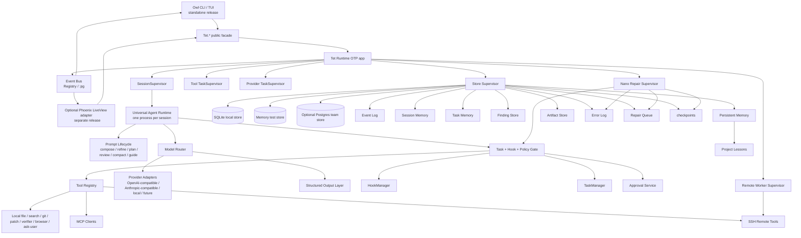

# Elixir CLI Agent Global Vision Plan
## 1 Project identity
**Product name:** Owl CLI, implemented with the internal Elixir namespace and public facade `Tet.*` until packaging settles the final executable alias. The meta-prompt names the app Owl CLI, while the strongest prior local architecture uses `Tet` as the runtime/core name to avoid collisions with Elixir's built-in `Agent` module; this plan keeps both ideas without letting naming block architecture. Source basis: `/Users/adam2/projects/tet/prompt.md`, `/Users/adam2/projects/tet/check this plans/plan claude/plan_v0.3/FINAL_ULTIMATE_PLAN.md`.

**Mission:** deliver an Elixir/OTP-native, CLI-first AI coding agent with Code Puppy-style agent behavior, durable state, safe task/hook gates, model/provider flexibility, optional remote workers, optional Phoenix observability, and Nano Repair Mode for controlled self-healing.

**Pitch:** Owl CLI is a terminal-native coding-agent workbench for people who want a serious operator console, not a web app wearing a trench coat. The CLI is the product core: it can chat, plan, inspect repositories, propose patches, ask for approvals, run allowlisted verification, recover sessions, stream events, dispatch remote work, and repair its own runtime. Phoenix LiveView is an optional adapter that visualizes and controls the same durable runtime, never the owner of state or policy.
## 2 Executive summary
The final application is a standalone Elixir/OTP runtime distributed as a CLI binary. Each user session is owned by a long-lived Universal Agent Runtime process supervised by OTP and backed by durable storage. The runtime composes prompts, routes model requests, enforces task/hook policy, executes tools, persists Event Log entries, stores artifacts, and publishes state updates to CLI/TUI renderers and optional Phoenix screens.

The product preserves the strongest Code Puppy behaviors: named agents/profiles, system prompt assembly, model pinnings, large-context history management, MCP integration, broad tool registry, plugin callbacks, session persistence, message bus semantics, and streaming retries. It redesigns those behaviors around Elixir boundaries: pure domain contracts, supervised runtime services, append-only Event Log, store adapters, deterministic policy gates, explicit approvals, and hot-reload-aware repair.

End-state Owl CLI supports local workspaces and remote SSH execution targets. Local execution remains the control plane; remote machines are less-trusted workers with heartbeat, cancellation, sandbox/workdir boundaries, redacted output, and result merge through Event Log and Artifact Store. Nano Repair Mode captures internal failures into Error Log, queues Repair Queue work, diagnoses under debugging tasks, proposes approved patches, compiles, smoke-tests, hot reloads or restarts safely, checkpoints the validated state, persists Project Lessons/Persistent Memory, and falls back to a minimal repair binary when the main CLI cannot boot.

Phoenix LiveView, when enabled, renders session timelines, diffs, approvals, task graphs, model telemetry, artifacts, remote worker status, and repair workflows through the same public `Tet.*` facade. The standalone CLI release contains no Phoenix, LiveView, Plug, Cowboy, or web endpoint dependency.
## 3 Design principles
- **CLI-first, not CLI-afterthought:** the standalone CLI binary is the default product and must run end-to-end without any web dependency. Source basis: `/Users/adam2/projects/tet/prompt.md`, `/Users/adam2/projects/tet/check this plans/plan 3/plan/docs/01_architecture.md`.
- **Code Puppy parity where it matters:** agent profiles, model selection, tool registration, history compaction, MCP lifecycle, hooks, config, session restore, and message bus behavior map directly from verified Code Puppy anchors such as `/Users/adam2/projects/tet/source/code_puppy-main/code_puppy/agents/base_agent.py`, `/Users/adam2/projects/tet/source/code_puppy-main/code_puppy/agents/_builder.py`, `/Users/adam2/projects/tet/source/code_puppy-main/code_puppy/agents/_runtime.py`, and `/Users/adam2/projects/tet/source/code_puppy-main/code_puppy/tools/__init__.py`.
- **Elixir/OTP-native runtime:** supervision, registries, task supervisors, event fanout, store processes, worker lifecycles, repair restarts, and optional hot-code reload are normal OTP responsibilities, not framework magic.
- **Phoenix optional adapter only:** LiveView may observe and control through `Tet.*`, but core state, policy, providers, tools, Event Log, Artifact Store, approvals, verification, remote execution, and repair remain outside Phoenix.
- **Plan-before-action:** every mutating or executing operation requires an active task, category gate, hook pass, policy approval, and persisted event trail.
- **Deterministic safety before model advice:** hard policy gates run before LLM steering. LLM steering can guide, focus, or recommend blocking, but cannot widen permissions.
- **Durability over process memory:** running processes are disposable; Event Log, Session Memory, Task Memory, Artifact Store, Error Log, Repair Queue, Persistent Memory, Project Lessons, and checkpoints are durable.
- **Provider/model neutrality:** provider quirks terminate at adapters; the runtime sees normalized streaming events, tool calls, usage, retry classification, and structured outputs. Source basis: `/Users/adam2/projects/tet/check this plans/plan claude/plan_v0.3/upgrades/11_provider_contract.md`.
- **Safe remote execution:** SSH workers are explicit, scoped, cancellable, heartbeat-monitored, and never receive raw master secrets.
- **Self-healing is auditable:** Nano Repair Mode is a controlled workflow with tasks, approvals, compile/smoke validation, rollback, checkpoints, and Project Lessons/Persistent Memory writes.
- **Small cohesive modules:** files and modules stay focused. Runtime god-objects are split by responsibility, following the refactor pattern visible in Code Puppy's `BaseAgent` delegating to `_history`, `_compaction`, `_builder`, and `_runtime`.
## 4 Research synthesis table
| Source / project / document | Strongest ideas | Elixir mapping | Cited local paths |
|---|---|---|---|
| Meta-prompt | CLI-first Owl CLI, Code Puppy parity, OTP-native runtime, optional Phoenix, renamed state terms, Universal Agent Runtime, Nano Repair Mode, remote SSH workers, five invariants. | Treat the prompt as the top-level requirements contract and resolve conflicts in favor of standalone CLI safety. | `/Users/adam2/projects/tet/prompt.md` |
| tet-d1c persisted synthesis | Locked ADRs for CLI/Phoenix boundary, custom OTP, profile hot-swap, model routing, tools/MCP gates, hook invariants, state naming, remote execution, Nano Repair Mode, missing-source handling. | Use bd comments as decision record feeding this global vision; do not cite unavailable internals. | `bd show tet-d1c` run from `/Users/adam2/projects/tet-sip` |
| Minimal core plan | Small safe core: session, prompt composer, one provider, read tools, patch approval, allowlisted verification, persisted timeline. | End state keeps the same spine and expands without bypassing gates. | `/Users/adam2/projects/tet/check this plans/tet agent_platform_minimal_core.md` |
| Final prior Tet plan | Umbrella-style separation, `Tet.*` facade, CLI release with no web closure, store adapters, optional Phoenix. | Use `tet_core`, `tet_runtime`, `tet_cli`, store adapters, and optional `tet_web_phoenix` boundaries conceptually. | `/Users/adam2/projects/tet/check this plans/plan claude/plan_v0.3/FINAL_ULTIMATE_PLAN.md` |
| Prior architecture plan | Runtime/core own policies and state; CLI and LiveView parse/render only; OTP supervision tree. | Preserve pure domain contracts, runtime application services, event bus, task supervisors, and optional web tree. | `/Users/adam2/projects/tet/check this plans/plan 3/plan/docs/01_architecture.md` |
| Prior tools/policy plan | Every tool intent goes through policy; patch proposal creates diff artifact and pending approval; verification allowlist by name. | Native `Tet.Tool` contracts, path policy, approval lifecycle, redaction, verifier runner. | `/Users/adam2/projects/tet/check this plans/plan 3/plan/docs/05_tools_policy_approvals_verification.md` |
| Provider contract upgrade | Normalized provider behaviour, streaming event taxonomy, tool-call mapping, retries, timeouts, idempotency keys. | `ModelRouter -> ProviderAdapter -> StructuredOutputLayer`, normalized tool calls, per-profile pins, telemetry. | `/Users/adam2/projects/tet/check this plans/plan claude/plan_v0.3/upgrades/11_provider_contract.md` |
| Durable execution upgrade | Idempotent durable steps, crash recovery, patch snapshots, rollback by change type. | Event Log plus checkpoints; workflow executor reconstructs state from durable step records before side effects. | `/Users/adam2/projects/tet/check this plans/plan claude/plan_v0.3/upgrades/12_durable_execution.md` |
| MCP and agents extension | MCP as tool source behind policy, operator read-only allowlist, agent profiles as data, slash commands. | Namespaced MCP tools, profile catalog, custom commands, no MCP bypass of task/policy/approval gates. | `/Users/adam2/projects/tet/check this plans/plan claude/plan_v0.3/extensions/15_mcp_and_agents.md` |
| Code Puppy agent runtime | `BaseAgent` identity/history/model/tools with builder/runtime/history/compaction helpers; streaming retries; cancellation; callbacks. | Universal Agent Runtime GenServer owns session state and delegates to focused services for prompt, provider, history, tools, and lifecycle. | `/Users/adam2/projects/tet/source/code_puppy-main/code_puppy/agents/base_agent.py`; `/Users/adam2/projects/tet/source/code_puppy-main/code_puppy/agents/_builder.py`; `/Users/adam2/projects/tet/source/code_puppy-main/code_puppy/agents/_runtime.py`; `/Users/adam2/projects/tet/source/code_puppy-main/code_puppy/agents/_history.py`; `/Users/adam2/projects/tet/source/code_puppy-main/code_puppy/agents/_compaction.py`; `/Users/adam2/projects/tet/source/code_puppy-main/code_puppy/agents/agent_manager.py` |
| Code Puppy model/config layer | Model registry JSON, custom endpoints, context lengths, supported settings, per-agent model pinning, round-robin distribution, XDG/legacy config. | Editable model registry, secret indirection, profile model pins, fallback/round-robin, provider capability checks, migration importer. | `/Users/adam2/projects/tet/source/code_puppy-main/code_puppy/model_factory.py`; `/Users/adam2/projects/tet/source/code_puppy-main/code_puppy/round_robin_model.py`; `/Users/adam2/projects/tet/source/code_puppy-main/code_puppy/models.json`; `/Users/adam2/projects/tet/source/code_puppy-main/code_puppy/config.py` |
| Code Puppy tools/MCP/hooks/session/messaging | Tool registry and plugin callback extension, MCP manager lifecycle, hook processing, session save/restore, queue-based UI/agent message bus. | Tool registry with capability metadata, supervised MCP clients, HookManager, store-backed sessions, runtime event subscriptions. | `/Users/adam2/projects/tet/source/code_puppy-main/code_puppy/tools/__init__.py`; `/Users/adam2/projects/tet/source/code_puppy-main/code_puppy/mcp_/manager.py`; `/Users/adam2/projects/tet/source/code_puppy-main/code_puppy/hook_engine/engine.py`; `/Users/adam2/projects/tet/source/code_puppy-main/code_puppy/hook_engine/models.py`; `/Users/adam2/projects/tet/source/code_puppy-main/code_puppy/session_storage.py`; `/Users/adam2/projects/tet/source/code_puppy-main/code_puppy/messaging/bus.py`; `/Users/adam2/projects/tet/source/code_puppy-main/code_puppy/callbacks.py` |
| Swarm-inspired plan/PDF | Task relevance, category gates, priority hooks, steering, blocked-attempt capture, findings pipeline, deterministic invariants. | TaskManager and HookManager enforce categories and five invariants; Finding Store and Project Lessons receive derived evidence. | `/Users/adam2/projects/tet/check this plans/first big plan/agent_platform_plan_final.md`; `/Users/adam2/projects/tet/check this plans/swarm-sdk-architecture.pdf` |
| Codex CLI anchors | Shell safety heuristics, policy rules, approval conflict handling, hook dispatch, JSON-RPC exec server, retained process output, migrations. | Shell approvals and verifier allowlists, policy overlays, remote worker protocol, output streaming, migration-safe store evolution. | `/Users/adam2/projects/tet/source/codex-main/codex-rs/core/src/exec_policy.rs`; `/Users/adam2/projects/tet/source/codex-main/codex-rs/execpolicy/src/policy.rs`; `/Users/adam2/projects/tet/source/codex-main/codex-rs/shell-command/src/command_safety/is_safe_command.rs`; `/Users/adam2/projects/tet/source/codex-main/codex-rs/shell-command/src/command_safety/is_dangerous_command.rs`; `/Users/adam2/projects/tet/source/codex-main/codex-rs/hooks/src/engine/dispatcher.rs`; `/Users/adam2/projects/tet/source/codex-main/codex-rs/exec-server/src/protocol.rs`; `/Users/adam2/projects/tet/source/codex-main/codex-rs/exec-server/src/local_process.rs`; `/Users/adam2/projects/tet/source/codex-main/codex-rs/exec-server/src/server/session_registry.rs`; `/Users/adam2/projects/tet/source/codex-main/codex-rs/state/migrations/0006_memories.sql`; `/Users/adam2/projects/tet/source/codex-main/codex-rs/state/src/migrations.rs` |
| Jido | Pure command/data split, directives, supervised runtime, plugin schemas, multi-agent orchestration. | Inspiration only: custom OTP owns v1; Jido may be an adapter behind runtime contracts if measured pain justifies it. | `/Users/adam2/projects/tet/source/jido-main/README.md` |
| LLxprt | Profiles capture provider/model/settings; shell substitution can be allowlisted or blocked; tool-output caps and profile overrides. | Profile UX, shell correction safety, nested command substitution policy, provider settings ergonomics. | `/Users/adam2/projects/tet/source/llxprt-code-main/docs/settings-and-profiles.md`; `/Users/adam2/projects/tet/source/llxprt-code-main/docs/shell-replacement.md` |
| Oh My Pi / Pi Mono | Terminal polish, sessions, context compaction, plugin/themes, lean monorepo packages, shareable session data. | TUI/DX inspiration only; core authority remains OTP runtime and Code Puppy parity. | `/Users/adam2/projects/tet/source/oh-my-pi-main/README.md`; `/Users/adam2/projects/tet/source/pi-mono-main/README.md` |
## 5 Top-level architecture diagram


The diagram intentionally puts CLI and optional Phoenix on the same side of the `Tet.*` facade. They are driving adapters. The runtime, stores, tools, policies, providers, repair, remote workers, and state terms are shared core services.
## 6 Module / OTP topology
The final system is an umbrella-style or equivalent release topology with strict dependency direction:

```text
tet_cli ----------------┐
                        ├── tet_runtime ── tet_core
tet_web_phoenix optional┘        │
                                 ├── tet_store_memory
                                 ├── tet_store_sqlite
                                 ├── tet_store_postgres optional
                                 └── provider/tool/remote adapters
```

**Core modules and ownership:**

| Area | Conceptual modules | OTP role | Owns / forbids |
|---|---|---|---|
| Pure domain | `Tet.Core.*` | Library only | Structs, commands, events, behaviours, policies, ids, validation. No GenServers, Ecto, terminal rendering, or Phoenix. |
| Runtime facade | `Tet` | Public API module | The only API called by CLI/Phoenix: workspaces, sessions, prompts, approvals, tasks, events, repair, remote profiles. |
| Application supervisor | `Tet.Runtime.Application` | Top supervisor | Starts telemetry, config, stores, registries, runtime supervisors, provider/tool/remote/repair supervisors. |
| Session registry | `Tet.Runtime.SessionRegistry` | Registry/GenServer | Maps session ids to Universal Agent Runtime processes and durable session metadata. |
| Universal runtime | `Tet.Runtime.UniversalAgent` | GenServer per session | Holds live state, rehydrates from store, runs turns, hot-swaps profiles, dispatches provider/tool workflows. |
| Prompt lifecycle | `Tet.Prompt.*` | Service modules + supervised tasks where needed | Prompt composition/refinement/review/compaction/guidance injection; never writes tools directly. |
| Model router | `Tet.Model.Router` | GenServer/service | Registry lookup, provider selection, per-profile pins, fallback, round-robin, retries, capability checks, telemetry. |
| Providers | `Tet.Provider.*` | Task-supervised adapters | Streaming normalized events and structured output; provider quirks stop here. |
| Tool registry | `Tet.Tool.Registry` | GenServer | Tool manifests, mode/category classification, MCP/native/remote namespaces. |
| Tool execution | `Tet.Tool.Executor` | TaskSupervisor | Runs tools only after task/hook/policy pass. Captures stdout/stderr/artifacts. |
| MCP | `Tet.MCP.Supervisor`, `Tet.MCP.Client` | DynamicSupervisor + GenServers | Stdio/HTTP lifecycle, discovery, quarantine, health, namespaced tools. |
| Task system | `Tet.TaskManager` | GenServer per workspace/session partition | Active task state, category gates, guidance events, task memory updates. |
| Hooks | `Tet.HookManager` | GenServer | Ordered hook registry, event matching, outcomes, blocking, durable hook events. |
| Approvals | `Tet.Approvals` | Service + store transactions | Pending/approved/rejected approval lifecycle; writes approval events and diff artifacts. |
| Stores | `Tet.Store.*` | Repo/process adapters | Memory test store, SQLite local store, optional Postgres store; migrations and artifact IO behind one behaviour. |
| Event bus | `Tet.EventBus` | Registry or `:pg` | Runtime subscriptions for CLI and optional web. No Phoenix PubSub in core. |
| Remote | `Tet.Remote.*` | Supervisor + connection GenServers | SSH profiles, worker bootstrap, heartbeat, cancel, output streaming, result merge. |
| Nano repair | `Tet.Repair.*` | Supervisor + workflow GenServers | Error capture, Repair Queue, diagnostic tasks, patch/compile/smoke/reload/checkpoint/rollback/fallback handoff. |

Standalone supervision tree:

```text
Tet.Runtime.Application
├── Tet.Telemetry
├── Tet.Config.Supervisor
├── Tet.Store.Supervisor
├── Tet.EventBus
├── Tet.Runtime.SessionRegistry
├── Tet.Runtime.SessionSupervisor
├── Tet.Model.ProviderSupervisor
├── Tet.Tool.TaskSupervisor
├── Tet.MCP.ClientSupervisor
├── Tet.TaskManager.Supervisor
├── Tet.HookManager
├── Tet.Remote.WorkerSupervisor
└── Tet.Repair.Supervisor
```

Optional Phoenix starts separately and subscribes to runtime events through `Tet.*`. It may have its own Endpoint, PubSub, LiveViews, and channels, but none of those are in the standalone release.
## 7 CLI/TUI surface
The CLI is both batch command surface and interactive TUI. It follows the Code Puppy spirit of session restore, agent selection, streaming output, slash commands, attachments, and tool UX, while keeping writes behind approvals.

**Top-level commands:**

| Command | Purpose |
|---|---|
| `owl doctor` | Validate release, store, config, providers, secrets references, workspace trust, hooks, repair binary, remote profiles. |
| `owl init [PATH] [--trust]` | Create workspace metadata and default config; trust only on explicit flag or prompt. |
| `owl workspace trust/info/revoke PATH` | Manage workspace trust records and boundaries. |
| `owl session new PATH --mode chat|plan|explore|execute --profile NAME --model MODEL` | Create persisted session. |
| `owl session list/show/resume/branch` | Restore, inspect, or branch sessions from checkpoints. |
| `owl chat|plan|explore|edit SESSION "prompt"` | Single-turn commands mapped to runtime modes. |
| `owl tui SESSION` | Full-screen or rich terminal event view with transcript, tasks, approvals, tool output, artifacts, and status. |
| `owl approvals SESSION`, `owl patch approve|reject APPROVAL_ID` | Resolve pending approvals. |
| `owl verify SESSION VERIFIER_NAME` | Run allowlisted verification by name. |
| `owl tasks list/start/complete/delete` | Manage task state and categories. |
| `owl profile list/show/swap` | Inspect and hot-swap runtime profiles at safe boundaries. |
| `owl model list/pin/test` | Inspect registry, test provider auth, pin profile/session model. |
| `owl mcp list/start/stop/status/tools` | Manage MCP servers and operator read-only allowlist visibility. |
| `owl remote list/test/start/stop/attach` | Manage SSH workers and remote sessions. |
| `owl repair status/diagnose/approve/rollback/fallback` | Operate Nano Repair Mode. |
| `owl events tail SESSION`, `owl artifacts open ARTIFACT_ID` | Replay timeline and inspect stored artifacts. |
| `owl config get/set/edit/import-code-puppy` | Manage config and migrate Code Puppy-like settings. |

**Interactive slash commands:** `/help`, `/status`, `/profile`, `/model`, `/task`, `/plan`, `/approve`, `/reject`, `/verify`, `/mcp`, `/remote`, `/repair`, `/attachments`, `/checkpoint`, `/events`, `/compact`, `/config`, `/quit`.

**Modes:** `chat` has no tools; `plan` permits read-only research and task planning; `explore` permits read-only repository inspection; `execute` permits mutating/executing tools only with active task, hooks, approvals, and verifier allowlist; `repair` is a controlled posture for Nano Repair Mode with debugging and acting sub-states.

**Attachments:** files, directories, images, URLs, prior artifacts, diff artifacts, remote logs, and checkpoints can be attached as references. Attachment contents are bounded, redacted, and persisted as Artifact Store entries or references, not silently shoved into prompt soup. Because apparently context windows are not a landfill. Who knew.

**Command correction:** the CLI may suggest corrected commands or safer alternatives, inspired by LLxprt shell replacement policy at `/Users/adam2/projects/tet/source/llxprt-code-main/docs/shell-replacement.md`, but it never auto-runs dangerous shell/write/remote operations. Nested command substitution is blocked by default or allowed only when all nested commands pass allowlist policy.
## 8 Configuration and secrets
Configuration separates **operator settings**, **workspace settings**, **secrets**, and **runtime state**.

**Proposed user locations:** Owl prefers a human-friendly Documents-folder root for non-secret user configuration and artifacts on desktop systems, with XDG-compatible fallback on Linux/headless systems. Code Puppy’s XDG/legacy behavior is the migration reference: `/Users/adam2/projects/tet/source/code_puppy-main/code_puppy/config.py`. Workspace-local config lives under a hidden workspace directory and is never trusted until the workspace is trusted.

**Configuration layers, highest precedence first:** CLI flags → session overrides → workspace config → user profile config → built-in defaults. This mirrors LLxprt profile override ergonomics from `/Users/adam2/projects/tet/source/llxprt-code-main/docs/settings-and-profiles.md` and Code Puppy session/global model behavior in `/Users/adam2/projects/tet/source/code_puppy-main/code_puppy/config.py`.

**Main config domains:**

| Domain | Stores | Notes |
|---|---|---|
| Identity | operator name, preferred CLI alias, telemetry opt-in | Not secret. |
| Workspaces | trusted roots, path policies, ignored directories, verifier allowlist | Trust is explicit and revocable. |
| Profiles | prompt layers, default mode/category, tool allowlist, policy overlays, model pin, structured-output expectations | Profiles are data, not executable code. |
| Models | registry entries, provider type, model id, context length, supported settings, cost hints, latency hints | Inspired by `/Users/adam2/projects/tet/source/code_puppy-main/code_puppy/models.json`. |
| Providers | base URLs, API versions, retry/timeouts, streaming flags, prompt-cache options | Secrets referenced by name only. |
| Tools | tool output caps, timeouts, verifier allowlist, MCP read-only allowlist, browser/tool toggles | MCP tools default to write classification unless allowlisted. |
| Hooks | event, phase, priority, matcher, action, timeout, enabled, scope | Hook results are persisted. |
| Remote | SSH host aliases, user, port, host key fingerprint, remote workdir, sandbox profile, secret references | No raw master secrets copied remotely. |
| Repair | smoke commands, compile commands, reload policy, fallback binary path, checkpoint retention | Requires approvals for writes. |

**Secrets:** API keys, OAuth tokens, SSH private keys/passphrases, remote sudo tokens, and webhook credentials live in the OS keychain when available, or encrypted local secret storage. Config files hold secret names such as `ANTHROPIC_API_KEY` or `ssh:gpu-runner`, never raw values. All display paths go through redaction before CLI, LiveView, logs, Event Log payloads, Artifact Store previews, provider payload dumps, and Error Log entries.

**Migration:** `owl config import-code-puppy` reads Code Puppy-style `puppy.cfg`, model registries, agents, MCP servers, and sessions where the user points it, maps model names, imports non-secret settings, creates secret references for environment-backed keys, and records a migration checkpoint. It does not deserialize unsafe historical payloads without explicit operator consent; Code Puppy session persistence uses pickle in `/Users/adam2/projects/tet/source/code_puppy-main/code_puppy/session_storage.py`, so migration treats those files as untrusted data.
## 9 Prompt lifecycle
The prompt lifecycle is a named pipeline, not a single mega-string with vibes and duct tape.

1. **Capture:** CLI/TUI or optional Phoenix submits user input, attachments, selected mode, profile, task context, and command metadata through `Tet.*`.
2. **Normalize:** trim unsafe control characters, resolve attachment references, apply prompt size limits, redact secrets, and persist user message to Session Memory and Event Log.
3. **Compose:** assemble system identity, profile prompt layers, workspace rules, task state, mode policy summary, tool contracts, relevant Session Memory, Task Memory, selected Persistent Memory, Project Lessons, and recent Event Log excerpts.
4. **Refine:** optional prompt refiner clarifies ambiguous tasks, splits ask vs action, and requests missing user input instead of guessing.
5. **Plan:** for `plan`, `explore`, `execute`, and `repair` modes, the runtime asks for an explicit plan or tool intent summary before action. Planning cannot widen permissions.
6. **Review:** deterministic policy and optional LLM reviewer inspect planned tool calls for task relevance, scope, and risk. Reviewer output becomes guidance or block events.
7. **Compact:** when context approaches profile/model limits, older conversation/tool material is summarized or truncated while preserving system prompt, recent turns, pending tool pairs, approvals, artifacts, tasks, and checkpoints. Code Puppy's compaction and pruning behavior is the reference: `/Users/adam2/projects/tet/source/code_puppy-main/code_puppy/agents/_history.py`, `/Users/adam2/projects/tet/source/code_puppy-main/code_puppy/agents/_compaction.py`.
8. **Inject guidance:** HookManager, TaskManager, Repair Queue, and policy warnings inject concise guidance after task operations and before risky tools.
9. **Dispatch:** ModelRouter receives normalized provider messages and tool declarations.
10. **Persist:** provider stream events, assistant responses, tool calls, tool outputs, usage, errors, and final summaries are recorded to Event Log before being treated as runtime truth.

The lifecycle preserves large-context behavior where models support it, but it never assumes provider-side prompt cache correctness. Cache hints are treated as optimization metadata and invalidated when profile, system prompt, tool schemas, or safety posture changes.
## 10 Agent system
The agent system is built around one Universal Agent Runtime per session, not a zoo of hardcoded processes that all secretly do the same thing badly.

**Orchestrator:** `Tet.Runtime.UniversalAgent` owns the session turn loop. It loads the active profile, composes prompts, routes model calls, interprets tool intents, enforces gates, records events, and delegates side effects to supervised services.

**Planner contract:** every non-chat run produces or updates a plan object tied to an active task. The planner identifies objective, constraints, files likely touched, tools requested, verification strategy, and rollback expectation. The plan is persisted in Task Memory and Event Log.

**Profile catalog:** profiles are named data bundles inspired by Code Puppy `BaseAgent` plus JSON agents and the prior MCP/agents extension. Fields include identity, display name, description, prompt layers, mode defaults, task category defaults, tool allowlist, MCP allowlist, policy overlays, model pin, provider preferences, output schema, reviewer posture, verifier defaults, context limits, compaction policy, remote permissions, and repair permissions. Code Puppy basis: `/Users/adam2/projects/tet/source/code_puppy-main/code_puppy/agents/base_agent.py`, `/Users/adam2/projects/tet/source/code_puppy-main/code_puppy/agents/agent_manager.py`, `/Users/adam2/projects/tet/check this plans/plan claude/plan_v0.3/extensions/15_mcp_and_agents.md`.

**Built-in profiles:** `planner`, `coder`, `reviewer`, `critic`, `retriever`, `tester`, `security`, `packager`, `json-data`, `remote-runner`, and `repair`. Each is a profile over the same runtime, not a separate runtime class.

**Approval gate:** model tool intents are proposals. Writes, patches, shell execution, remote execution, MCP write tools, config changes, repair patches, checkpoint rollback, and secret-affecting actions route through policy and approval services before execution.

**Specialized workers:** worker agents can run as sub-sessions or delegated tasks under the same Event Log and task model. They receive bounded context, explicit task category, tool subset, budget, deadline, and result schema. Results merge through Task Memory and Artifact Store; the parent runtime remains responsible for final user-visible action.
## 11 Universal runtime profile hot-swap
Profile hot-swap is a first-class runtime operation, not a glorified `/set prompt` command.

**Runtime state preserved across profile swaps:**

| State field | Preserved? | Rules |
|---|---:|---|
| Session id and Event Log cursor | Yes | The session remains one durable timeline; swap emits `profile.swap.requested` and `profile.swap.applied` events. |
| Session Memory | Yes | Existing transcript remains, with profile-change marker. |
| Task Memory | Yes | Active tasks persist unless the new profile lacks permission for the active category; then runtime pauses for user choice. |
| Artifact Store references | Yes | Attachments, diffs, stdout/stderr, prompt debug, snapshots, remote outputs remain addressable. |
| Pending approvals | Yes | Approvals survive; new profile cannot apply an approval it is not authorized to apply. |
| Attachments | Yes | Retained by reference; profile-specific prompt composer decides relevance. |
| MCP handles | Conditionally | Handles remain only if the target profile allows the server/tool namespace and transport health is valid. Otherwise handles are detached, not destroyed. |
| Provider cache hints | Conditionally | Preserved only when provider, model, system-prefix compatibility, tool schema compatibility, and cache policy match. |
| Streaming provider call | No unsafe mid-swap | Swap is queued until turn boundary unless user chooses interrupt-and-fork. |
| Running tool/remote command | No unsafe mid-swap | Swap waits, cancels with approval, or forks a new checkpointed session. |
| Error Log / Repair Queue visibility | Yes | Repair-critical warnings remain injected regardless of profile unless disabled by emergency fallback policy. |
| Budget/cost counters | Yes | Counters stay with session and task. |

**Profile struct, conceptually:** name, version, display name, description, prompt layers, default mode, allowed modes, default task category, allowed task categories, tool allowlist, MCP allowlist, remote allowlist, policy overlays, hook overlays, model pin, provider preferences, structured output schema, reviewer strategy, verifier set, compaction settings, context budget, artifact visibility, repair capabilities, and migration metadata.

**`swap_profile` semantics:**

1. Validate requested profile exists and is compatible with current workspace trust state.
2. Compute capability diff: tools, MCP, remote, model, prompt, output schema, policy, task category.
3. If a provider stream/tool/approval/remote job is active, choose one of three explicit modes: `queue_until_turn_boundary`, `interrupt_and_checkpoint`, or `fork_from_checkpoint`.
4. Persist a pre-swap checkpoint containing active profile, task state, prompt fingerprints, tool schemas, and provider cache metadata.
5. Apply new profile atomically in runtime state and store session metadata.
6. Invalidate prompt/provider caches when prompt layers, tool schemas, safety posture, model, provider, or output schema changes.
7. Rebuild tool declarations and MCP exposure from the new allowlist.
8. Emit guidance explaining changed capabilities to the model and user.
9. On failure, restore from pre-swap checkpoint and keep the session on the old profile.

**Provider limitations:** some providers tie cache entries to system prompts, tool schemas, model ids, or account state; those caches are opportunistic only. If cache preservation cannot be proven, the router discards the hint and pays the token cost rather than corrupting behavior. Round-robin profiles cannot guarantee cache locality unless all candidates share compatible cache semantics.
## 12 Model/provider routing
Model routing is centralized. No CLI command, profile, Phoenix view, or tool calls providers directly.

**Pipeline:** `ModelRouter -> ProviderAdapter -> StructuredOutputLayer -> Event Log`.

**Router responsibilities:** resolve model registry entry, merge profile/session/user overrides, check capabilities, select provider adapter, enforce budget, apply retry policy, choose fallback or round-robin candidate, normalize streaming events, collect usage/cost/latency, and emit telemetry. Code Puppy references: `/Users/adam2/projects/tet/source/code_puppy-main/code_puppy/model_factory.py`, `/Users/adam2/projects/tet/source/code_puppy-main/code_puppy/round_robin_model.py`, `/Users/adam2/projects/tet/source/code_puppy-main/code_puppy/models.json`.

**Provider adapters:** at minimum Anthropic-compatible and OpenAI-compatible adapters, with local OpenAI-compatible endpoints for Ollama/vLLM/llama.cpp style servers. Additional adapters are plugins only after the contract is stable.

**Structured output:** tool calls and JSON/data outputs are normalized into one internal shape. Provider-native oddities such as stringified JSON function arguments, streaming deltas, provider-assigned call ids, and usage events terminate at adapters. Contract basis: `/Users/adam2/projects/tet/check this plans/plan claude/plan_v0.3/upgrades/11_provider_contract.md`.

**Fallback:** retry only retryable transport/provider failures; do not retry validation errors, unsafe tool arguments, auth errors, user cancellations, or approval rejections. Fallback candidates must satisfy profile capability requirements and context length requirements.

**Round-robin:** useful for rate-limit distribution, not correctness fallback. Candidate rotation is recorded in Event Log so a session can be audited. Per-profile pins override global defaults unless the user explicitly chooses automatic routing.

**Telemetry:** model id, provider, profile, request id, prompt fingerprint, cache hit/miss when known, input/output tokens, latency, retry count, fallback reason, cost estimate, finish reason, and tool-call count. Sensitive payloads are redacted or stored as restricted artifacts.
## 13 Tooling and MCP
Every tool is a manifest plus executor. Manifests declare name, namespace, description, argument schema, read/write/execute classification, modes, task categories, approval requirement, path policy, timeout, output caps, redaction class, remote eligibility, and source.

**Native tools:**

| Tool family | Examples | Safety posture |
|---|---|---|
| Files | list directory, read file, search text, inspect metadata | Read-only, path bounded, size capped, `.git`, build dirs, and runtime internals hidden by default. |
| Patch | propose patch, validate patch, apply approved patch, rollback patch | Proposal writes artifacts only; apply requires approval, snapshot, dry-run, checkpoint, rollback plan. |
| Git | status, diff, selected read-only log/show; commit only if explicitly enabled later | No raw passthrough; dangerous flags blocked or approval-gated. Codex shell policy anchors inform this. |
| Shell/verifier | named verification commands, compile, smoke tests | Allowlisted by name; no arbitrary shell strings in normal agent flow. |
| Browser/TUI | optional browser inspection, screenshots, terminal screenshots | Disabled by default in untrusted workspaces; artifacts are redacted. |
| Ask user | yes/no, multi-select, free-form clarification | User input becomes durable event and may resolve approval/plan ambiguity. |
| Subagents | delegate research/review/test tasks | Bounded context, tool subset, budget, deadline, result schema. |
| Remote tools | run verifier, read artifact, stream logs on SSH worker | Scoped to remote profile and merged through Event Log. |

Code Puppy tool registry basis: `/Users/adam2/projects/tet/source/code_puppy-main/code_puppy/tools/__init__.py`.

**MCP:** MCP servers are supervised clients. Discovery registers tools as `mcp:<server_name>:<tool_name>`. MCP transports include stdio and HTTP/SSE or streamable HTTP where supported. Server self-reported read-only hints are displayed but not trusted; operator config must promote a specific MCP tool to read-only. Source basis: `/Users/adam2/projects/tet/source/code_puppy-main/code_puppy/mcp_/manager.py`, `/Users/adam2/projects/tet/check this plans/plan claude/plan_v0.3/extensions/15_mcp_and_agents.md`.

**Tool flow:** provider intent → argument normalization → task category gate → hook pre-phase → path/secret/sandbox policy → approval decision → execution via TaskSupervisor/remote worker/MCP client → output redaction → Artifact Store write if large → Event Log append → post-hooks → guidance.
## 14 Hook system
Hooks are deterministic interception points around lifecycle events. They may `continue`, `block`, `modify`, or `guide`. They never become durable source of truth; their outcomes are recorded in Event Log and interpreted by runtime policy. Code Puppy hook basis: `/Users/adam2/projects/tet/source/code_puppy-main/code_puppy/hook_engine/engine.py`, `/Users/adam2/projects/tet/source/code_puppy-main/code_puppy/hook_engine/models.py`, callback phases in `/Users/adam2/projects/tet/source/code_puppy-main/code_puppy/callbacks.py`. Codex dispatcher basis: `/Users/adam2/projects/tet/source/codex-main/codex-rs/hooks/src/engine/dispatcher.rs`.

| Hook | Priority | Phase ordering | Blocks? | Purpose | Source inspiration |
|---|---:|---|---:|---|---|
| `session_start` | 900 | startup | No | Load workspace rules, repair warnings, profile hints, remote health summary. | Code Puppy `SessionStart`; Codex hook dispatcher; Swarm PDF at `/Users/adam2/projects/tet/check this plans/swarm-sdk-architecture.pdf`. |
| `user_prompt_submit` | 850 | pre-turn high→low | Yes | Reject unsafe prompt actions, inject required clarification, link prompt to task. | Code Puppy callbacks and prior first big plan. |
| `repair_queue_check` | 825 | pre-turn high→low | Yes | Pause normal action if critical Error Log item requires repair triage. | `/Users/adam2/projects/tet/prompt.md`. |
| `task_relevance_precheck` | 800 | pre-tool high→low | Yes | Ensure tool intent matches active task and category. | Swarm-inspired task enforcement. |
| `mode_policy_precheck` | 780 | pre-tool high→low | Yes | Enforce chat/plan/explore/execute/repair tool matrix. | `/Users/adam2/projects/tet/check this plans/plan 3/plan/docs/05_tools_policy_approvals_verification.md`. |
| `path_boundary_check` | 760 | pre-tool high→low | Yes | Canonicalize paths, block symlink/outside workspace escapes. | Prior tools policy and Codex safety anchors. |
| `secret_redaction_precheck` | 740 | pre-tool high→low | Yes | Prevent secret exfiltration and redact arguments. | Code Puppy config/secrets patterns; prior plans. |
| `mcp_classification_check` | 720 | pre-tool high→low | Yes | Treat MCP tools as write unless operator allowlisted. | `/Users/adam2/projects/tet/check this plans/plan claude/plan_v0.3/extensions/15_mcp_and_agents.md`. |
| `remote_scope_check` | 700 | pre-remote high→low | Yes | Validate SSH profile, host key, remote sandbox, credential scope. | Codex exec-server and first big plan. |
| `approval_required` | 650 | pre-side-effect high→low | Yes | Convert write/execute/remote/repair intent into pending approval. | Prior tools/policy plan. |
| `provider_request_prepare` | 500 | pre-provider high→low | Modify | Add profile/model settings, cache hints, budget metadata. | Code Puppy model factory; provider contract. |
| `provider_stream_observe` | 300 | during-provider | No | Record deltas, usage, stalls, retry hints. | Code Puppy streaming retry; provider contract. |
| `post_tool_capture` | 250 | post-tool low→high | No | Persist outputs, artifacts, duration, changed files, result summary. | Code Puppy post-tool callbacks; Codex hook summaries. |
| `task_guidance_after_change` | 220 | post-task low→high | Guide | Tell runtime/model what the task state implies next. | Swarm-inspired guidance after task operations. |
| `verification_result` | 200 | post-verifier low→high | Guide | Interpret compile/test/smoke outcome and suggest next state. | Durable execution and Nano Repair requirements. |
| `error_captured` | 100 | post-error low→high | Guide | Create Error Log/Repair Queue entry and notify session. | `/Users/adam2/projects/tet/prompt.md`. |
| `session_stop` | 50 | shutdown | No | Persist final summaries, checkpoints, cleanup leases. | Code Puppy stop/subagent stop hooks. |

Pre-action hooks run high-to-low priority so strict safety gates win first. Post-action hooks run low-to-high priority so capture happens before advisory guidance. Hook failures are themselves Event Log entries; a failing non-critical advisory hook cannot crash the runtime.
## 15 Task system
Tasks are durable state machines with category gates. They are not a fancy todo list. They are the leash on the agent. Yes, the leash is necessary; models see `rm -rf` and think “walkies.”

**State machine:** `pending -> in_progress -> completed | deleted`. A deleted task is retained as an audit event, not erased from history.

**Categories:** `researching`, `planning`, `acting`, `verifying`, `debugging`, `documenting`.

**Category gates:**

| Category | Allowed posture | Mutating/executing? |
|---|---|---:|
| `researching` | Read-only search, file inspection, artifact review | No |
| `planning` | Read-only research, plan creation, task decomposition | No writes; no shell except explicitly allowlisted read-only probes |
| `acting` | Patch proposal, approved patch apply, controlled shell/remote execution | Yes, with approvals and policy |
| `verifying` | Allowlisted compile/test/smoke commands and result analysis | Execute only named verifiers |
| `debugging` | Diagnostic tools, logs, read-only inspection, Error Log analysis | No mutation until repair plan accepted and acting repair task created |
| `documenting` | Docs/artifact drafting and approved docs patches | Writes only through approval |

**Five invariants:**

1. **No mutating/executing tool without an active task.**
2. **Category-based tool gating.**
3. **Priority-ordered hook execution.**
4. **Guidance after task operations.**
5. **Complete event capture.**

Task operations emit events and update Task Memory. Blocked attempts are persisted with reason atoms. The active task id is included in provider requests, tool runs, approvals, artifacts, remote jobs, repair items, verifier runs, and checkpoints.
## 16 State, memory, and recovery
Final state terms are deliberately practical and renamed: Event Log, Session Memory, Task Memory, Finding Store, Persistent Memory, Project Lessons, Artifact Store, Error Log, Repair Queue, and checkpoints.

| Store concept | Purpose | Retention |
|---|---|---|
| Event Log | Append-only timeline of domain, runtime, policy, hook, provider, tool, approval, remote, verifier, and repair events. | Retain complete metadata; compact large payloads into Artifact Store references. |
| Session Memory | Transcript and session-scoped summaries used for prompt continuity. | Keep recent turns verbatim; compact older turns with checkpoints. |
| Task Memory | Active and historical task plans, decisions, constraints, files, and verification notes. | Retain with session; promote reusable findings when evidenced. |
| Finding Store | Structured observations extracted from events, tools, failures, reviews, and verifiers. | Deduplicate and score with evidence; never used as unquestioned truth. |
| Persistent Memory | Cross-session operator/workspace knowledge approved for reuse. | Versioned and revocable. |
| Project Lessons | Durable lessons from successful repairs, recurring errors, project conventions, and verification outcomes. | Promoted only with evidence and source event references. |
| Artifact Store | Diffs, stdout/stderr, file snapshots, prompt debug, provider payloads, screenshots, remote bundles, repair evidence. | Content-addressed; retention policy by kind and privacy class. |
| Error Log | Structured exceptions, crashes, compile failures, smoke failures, remote worker failures, tool failures, and repair outcomes. | Retain open errors until resolved; summarize old resolved items. |
| Repair Queue | Work items generated from Error Log or operator request. | FIFO within priority; critical boot failures surface before normal turns. |
| checkpoints | Recoverable snapshots of session/runtime/profile/task/artifact pointers and workspace patch state. | Kept before risky actions, profile swaps, patch apply, repair, remote merge, and release upgrade. |

**On-disk layout concept:** user config/state under the Owl user root, workspace metadata under the workspace hidden directory, artifacts content-addressed under the configured Artifact Store root, and store databases under the active store adapter. SQLite is the default local store; memory is for tests; Postgres is optional for team/server use. Prior storage inspiration: `/Users/adam2/projects/tet/check this plans/plan claude/plan_v0.3/upgrades/12_durable_execution.md`, `/Users/adam2/projects/tet/source/code_puppy-main/code_puppy/session_storage.py`, Codex migrations at `/Users/adam2/projects/tet/source/codex-main/codex-rs/state/migrations/0006_memories.sql` and runtime migration behavior at `/Users/adam2/projects/tet/source/codex-main/codex-rs/state/src/migrations.rs`.

**Recovery:** on startup, runtime scans pending workflows, incomplete tool runs, open approvals, remote leases, Error Log entries, and checkpoints. It reconstructs Universal Agent Runtime state from durable records, not from process memory. In-flight side effects are classified as safe-to-retry, needs-human-resolution, rolled-back, or failed-open-with-repair-item.
## 17 Remote execution
Remote execution is SSH-based. Local Owl remains the control plane; remote hosts are execution targets.

**SSH profile config:** alias, host, port, user, host-key fingerprint, auth secret reference, remote workdir, allowed commands/verifiers, environment policy, file sync policy, sandbox profile, network policy, max runtime, artifact caps, and repair eligibility.

**Worker lifecycle:** validate host key → establish SSH → bootstrap or verify worker binary/script → create remote workspace lease → start heartbeat → stream stdout/stderr/artifacts → accept cancellation → checkpoint result → merge Event Log/Artifact Store references → clean up lease according to policy.

**Sandboxing:** remote worker gets least-privilege credentials, scoped workdir, optional container/namespace/sandbox wrapper, restricted environment, no raw master secrets, and no implicit access to local files. Remote commands use verifier/tool names, not arbitrary shell strings, unless the operator explicitly opens an approval-gated shell task.

**Heartbeat/cancellation:** RemoteWorker GenServer tracks monotonic heartbeat, process ids, output sequence, last artifact checkpoint, cancellation token, and reconnect window. If heartbeat expires, the runtime marks the remote job uncertain, attempts reconnect/resync, and may queue Repair Queue or user-resolution work.

**Artifact streaming:** remote stdout/stderr/logs/diffs/snapshots are chunked, redacted, content-addressed, and stored locally. Large outputs remain artifacts with summaries in Session Memory.

**Result merge:** remote changes do not silently mutate local workspace. Patch artifacts, verifier outputs, and generated files merge through the same approval/policy/checkpoint path as local work. Codex exec-server process and protocol ideas are adapted from `/Users/adam2/projects/tet/source/codex-main/codex-rs/exec-server/src/protocol.rs`, `/Users/adam2/projects/tet/source/codex-main/codex-rs/exec-server/src/local_process.rs`, and `/Users/adam2/projects/tet/source/codex-main/codex-rs/exec-server/src/server/session_registry.rs`.
## 18 Self-healing / Nano Repair Mode
Nano Repair Mode is a supervised subsystem for repairing Owl itself or its workers without turning the agent into an unsupervised self-modifying gremlin.

**1. Detect/capture:** capture internal exceptions, supervisor crashes, provider adapter crashes, tool failures, MCP crashes, compile failures, failed smoke tests, hot reload failures, config migration failures, store migration failures, and remote worker failures. Each item becomes a structured Error Log record with stack/context, runtime version, profile, task, command, relevant artifacts, redacted environment summary, and severity.

**2. Queue:** create or update a Repair Queue item with priority, affected subsystem, reproducibility hints, blocked sessions, candidate verifier/smoke commands, and required approval class. Deduplicate repeated failures by fingerprint.

**3. Pre-turn check:** before handling normal prompts, the runtime checks open critical Repair Queue items. Critical boot/runtime corruption pauses normal action and asks the operator whether to diagnose, ignore once, or use fallback repair binary.

**4. Diagnose:** diagnosis runs under a `debugging` task with diagnostic-only tools: read logs, inspect artifacts, run allowlisted read-only checks, inspect store status, query supervisor tree, and reproduce with bounded commands. No writes during diagnosis.

**5. Plan:** repair profile creates a repair plan: root cause, files/config likely affected, patch strategy, tests/smoke commands, hot reload vs restart decision, rollback plan, and operator approval request.

**6. Patch:** patching requires an active `acting` repair task, workspace/runtime trust, approval, snapshot, and checkpoint. Repair patches go through the same patch proposal/apply gates as user code.

**7. Compile:** run configured compile/build command by name. For Elixir runtime, this includes compile checks for affected apps and release sanity where relevant. Output is stored as artifacts and summarized.

**8. Smoke:** run configured smoke tests: CLI boot, `doctor`, store open, event bus subscribe, model stub call, tool policy sample, and affected subsystem check. Remote worker repairs include SSH handshake and heartbeat smoke.

**9. Hot reload/restart:** if safe, use OTP primitives such as module purge/load, application restart, supervisor child restart, release handler strategy, or runtime subtree restart. If code shape or state migration makes hot reload unsafe, perform full runtime restart from checkpoint. The plan must state which path was chosen and why.

**10. Checkpoint/version:** after successful compile and smoke, write a checkpoint and version marker containing repair id, changed artifacts, verifier outputs, and rollback pointer.

**11. Project Lessons/Persistent Memory:** persist an evidence-backed Project Lesson and, when broadly reusable, a Persistent Memory entry with failure fingerprint, diagnosis, fix, tests, and prevention note.

**12. Rollback:** if compile/smoke/reload fails, restore from checkpoint/snapshots, mark repair attempt failed, keep Error Log item open, and emit user-visible guidance. Rollback is idempotent and recorded.

**13. Fallback repair binary:** ship a minimal safe repair release independent enough to run when the main CLI cannot boot. Its only workflow is `diagnose -> patch -> compile -> smoke -> checkpoint -> hand control back`. It has no arbitrary provider/tool surface unless explicitly configured, uses local store/artifacts, and requires human approval for writes.

Human approval is required for every repair write, config migration, dependency change, remote worker change, hot reload of running code, release restart, checkpoint rollback, and fallback binary handoff.
## 19 Optional Phoenix LiveView layer
Phoenix LiveView is an optional adapter/control surface, not the runtime. It calls `Tet.*`, subscribes to runtime events, and renders state from durable records.

**Boundary rules:** no provider calls, no tool execution, no patch application, no approval state mutation outside `Tet.*`, no direct store writes, no Event Log ownership, no repair execution, and no Phoenix dependency in core/runtime/CLI/store apps.

**Internal API:** LiveView uses the same public facade as CLI: start/resume sessions, submit prompts, list/resolve approvals, list events, view artifacts, swap profiles, manage tasks, inspect remote workers, and operate repair workflows.

**PubSub/WebSocket bridge:** core EventBus uses Registry/`:pg` or equivalent. The optional web app bridges those events into Phoenix PubSub/WebSocket for browser clients. Phoenix PubSub is not imported into `tet_runtime`.

**Screens:** session timeline, transcript, live token stream, tasks, active profile/model, tool calls, approvals, diff viewer, verifier output, Artifact Store browser, Error Log, Repair Queue, remote workers, model/provider telemetry, hook/policy trace, prompt debug, and settings editor.

**CLI independence:** standalone release CI proves the CLI compiles and boots with zero Phoenix/Plug/Cowboy/LiveView dependencies, matching the acceptance stance in `/Users/adam2/projects/tet/check this plans/plan claude/plan_v0.3/FINAL_ULTIMATE_PLAN.md`.
## 20 Plugin and extension model
Extensions are capability manifests loaded by the runtime, not random code blobs with a fake mustache. Keep it boring; boring is how computers avoid eating homework.

**Plugin types:** provider adapter, tool adapter, MCP server catalog entry, profile pack, prompt pack, slash command, hook pack, verifier pack, theme, renderer extension, remote worker template, repair diagnostic pack.

**Registration:** plugins declare name, version, source, capabilities, required permissions, config schema, secret references, hooks, tools/profiles provided, and compatibility constraints. Runtime validates manifests before enabling. Unknown capabilities are ignored safely.

**Profiles:** user and workspace profile packs may add profiles, but profiles cannot define arbitrary executable code. They can restrict tools, select prompt layers, set model preferences, and choose policies.

**Tools:** native tool plugins implement the same tool contract and are disabled in untrusted workspaces until explicitly allowed. MCP tools remain namespaced and policy-gated.

**Providers:** provider plugins implement the provider behaviour and structured streaming contract. They must pass conformance tests with recorded streams and normalized tool calls.

**Themes/TUI:** terminal themes and keybindings affect rendering only. They cannot alter runtime policy.

**Source inspirations:** Code Puppy plugin callbacks in `/Users/adam2/projects/tet/source/code_puppy-main/code_puppy/callbacks.py`, tool registry in `/Users/adam2/projects/tet/source/code_puppy-main/code_puppy/tools/__init__.py`, Jido plugin/directive ideas in `/Users/adam2/projects/tet/source/jido-main/README.md`, Oh My Pi extension/theme UX in `/Users/adam2/projects/tet/source/oh-my-pi-main/README.md`.
## 21 Security and sandboxing
Security is enforced in runtime policy, not in prompts. Prompts can remind; policy decides.

**Secrets:** secret references only in config; raw secrets in OS keychain/encrypted store; redaction before display/log/event/artifact; no raw master secrets on remote workers; provider payload artifacts restricted by privacy class.

**Filesystem:** canonicalize paths, resolve symlinks, block outside workspace, block runtime internals by default, cap reads/searches, summarize binary files, snapshot before writes, and keep rollback manifests for patch apply.

**Shell:** normal workflow runs named verifier commands, not raw shell. Optional shell tasks require active task, policy, command parsing, dangerous-command detection, nested substitution policy, approval, timeout, scrubbed env, stdout/stderr artifacts, and cancellation. Codex shell safety sources: `/Users/adam2/projects/tet/source/codex-main/codex-rs/shell-command/src/command_safety/is_safe_command.rs`, `/Users/adam2/projects/tet/source/codex-main/codex-rs/shell-command/src/command_safety/is_dangerous_command.rs`, `/Users/adam2/projects/tet/source/codex-main/codex-rs/core/src/exec_policy.rs`.

**Approvals:** patch/write/shell/remote/MCP-write/repair/config/secret-affecting actions require explicit user approval. Approval prompts include diff/command/host/tool, risk classification, task id, profile, expected artifacts, rollback plan, and verifier plan.

**Remote:** host-key verification, least-privilege remote user, scoped workdir, sandbox/container where available, heartbeat, cancellation, no credential sprawl, redacted streams, and local merge through approval.

**Audit:** every allow/block/modify/guide decision, approval, tool run, provider request, remote job, repair action, and checkpoint writes to Event Log with actor/session/task/profile metadata.
## 22 Testing and verification strategy
Testing proves boundaries and behavior, not just happy-path demos.

| Layer | Verification |
|---|---|
| Domain/core | Pure unit tests for ids, policies, task transitions, path decisions, approval state, event schemas, redaction, profile validation. |
| Store contracts | Shared test suite for memory, SQLite, optional Postgres; migration forward/backward safety; artifact integrity; checkpoint recovery. |
| Runtime | GenServer lifecycle tests, crash/restart recovery, profile hot-swap, queued swaps, cancellation, Event Log replay, task/hook invariants. |
| Prompt lifecycle | Golden prompt tests with redaction, compaction boundaries, tool pair preservation, guidance injection, prompt debug artifacts. |
| Providers | Stub adapters, recorded stream parsers, tool-call normalization, retry classification, stall timeout, fallback, round-robin telemetry. |
| Tools | Path escape adversarial tests, patch snapshot/rollback, verifier allowlist, shell substitution policy, MCP read-only allowlist, output caps. |
| Hooks/tasks | Priority order, block/modify/guide outcomes, failed hooks, complete event capture, category gates. |
| CLI/TUI | Command parsing, exit codes, session restore, streaming render, approval UX, config migration dry runs. |
| Phoenix optional | Boundary tests proving LiveViews call `Tet.*` only; no web dependency in standalone release. |
| Remote | SSH test harness, host key failure, heartbeat loss, cancellation, artifact streaming, result merge, remote sandbox policy. |
| Nano Repair | Synthetic crashes, compile failures, smoke failures, rollback, fallback binary handoff, Project Lessons/Persistent Memory persistence. |
| Release | Standalone binary boots, `doctor` passes, no Phoenix closure, config dirs permissions, repair binary available. |

Verification commands are allowlisted by name in config. The final product ships with provider stubs so CI does not require paid model calls.
## 23 Observability
Observability is built on structured events, metrics, traces, and operator views.

**Logs:** structured JSON or rich terminal logs with event id, session id, task id, profile, provider, tool, remote worker, repair id, severity, duration, and redacted details.

**Metrics:** sessions active, provider latency, tokens, cost estimate, retry/fallback counts, tool durations, approval wait time, blocked attempts, verifier pass/fail, remote heartbeat, repair success/rollback, store latency, Event Log growth, Artifact Store size.

**Traces:** one trace per turn with spans for prompt compose, provider call, tool intent, policy, hook phases, tool execution, artifact write, verifier, remote worker, repair stages, and event publication.

**Event timeline:** CLI/TUI and optional Phoenix can replay the Event Log as an ordered timeline with filters for provider/tool/task/approval/error/repair/remote.

**Views:** task graph, Artifact Store browser, Error Log, Repair Queue, profile/model panel, hook/policy trace, prompt debug, remote worker dashboard, cost/budget summary, checkpoint list.
## 24 Risks and tradeoffs
| Risk / tradeoff | Why it matters | Mitigation |
|---|---|---|
| Hot reload can corrupt state if overused | OTP hot code reload is powerful, not magic glitter. | Prefer supervisor subtree restart or full restart when state shape changes; checkpoint first. |
| Provider cache preservation is unreliable | Cache semantics vary by provider/model/tool schema. | Treat cache hints as optimization only; invalidate aggressively. |
| Profile hot-swap during tools/streams is tricky | Mid-turn state can become inconsistent. | Queue swaps to turn boundary by default; interrupt/fork only with checkpoint. |
| Self-repair can become unsafe self-modification | The agent may patch its own runtime incorrectly. | Require tasks, approvals, compile, smoke, checkpoints, rollback, fallback binary. |
| Remote execution expands attack surface | SSH workers may expose secrets or mutate wrong hosts. | Host-key pinning, least privilege, scoped secrets, sandbox, explicit approvals, redacted streams. |
| MCP tools can lie about safety | Server metadata is not a trust boundary. | Default MCP tools to write classification; operator read-only allowlist only. |
| Optional Phoenix can leak into core | Web deps can quietly infect runtime. | CI xref/dependency closure tests; facade-only access. |
| Store/Event Log growth | Durable timelines can grow forever. | Artifact offloading, retention classes, summaries, checkpoints, pruning policies with audit preservation. |
| Provider adapter sprawl | Every provider has weird edge cases. | Small first adapter set, conformance tests, plugin contract. |
| Config location tension | Documents UX vs XDG/headless expectations. | Layered location resolver and explicit `doctor` output; migration support. |
## 25 Open questions
1. **Final executable alias:** this plan uses Owl CLI as product name and `Tet.*` as internal facade, but packaging must decide whether the primary binary is `owl`, `tet`, or both.
2. **Default user config root:** Documents-folder UX is desired, while XDG is better for Linux/headless. The resolver should be decided before implementation, with `doctor` making it obvious.
3. **First shipped paid provider:** Anthropic-compatible and OpenAI-compatible contracts are clear, but the first default model/provider should be selected by current user preference, availability, and cost.
4. **Fallback repair binary packaging:** exact packaging mechanism should be chosen with the release tool so the fallback can run when the main CLI cannot boot.
5. **Remote sandbox baseline:** SSH is agreed, but the default remote sandbox strategy may differ by macOS/Linux/VPS/container availability.
6. **Unavailable source families:** G-domain/agent-domain and exact LLExpert internals were not verified locally; this plan must not claim details from them until actual local paths exist.
## 26 Glossary
| Term | Definition |
|---|---|
| Owl CLI | Product name for the standalone Elixir/OTP CLI-first coding agent. |
| `Tet.*` facade | Public Elixir API boundary consumed by CLI and optional Phoenix. |
| Universal Agent Runtime | Long-lived session process that owns prompt/model/tool/task orchestration and can hot-swap profiles. |
| Profile | Data bundle defining identity, prompts, tools, policies, model preferences, output schema, verifier posture, and category defaults. |
| Profile hot-swap | Safe runtime operation that changes active profile while preserving durable session/task/artifact state and invalidating unsafe caches. |
| Task | Durable unit of work with state, category, plan, memory, and approval/tool correlation. |
| Task category | Deterministic gate such as researching, planning, acting, verifying, debugging, or documenting. |
| Event Log | Append-only source of audit/replay events for sessions, tools, providers, policies, hooks, approvals, remote work, and repair. |
| Session Memory | Durable session transcript and summaries used for conversational continuity. |
| Task Memory | Durable task-scoped plans, decisions, findings, constraints, and verification notes. |
| Finding Store | Structured evidence-backed observations extracted from events, tools, reviews, and failures. |
| Persistent Memory | Approved cross-session knowledge that may be reused by future sessions. |
| Project Lessons | Evidence-backed lessons from repairs, recurring errors, project conventions, and verifier outcomes. |
| Artifact Store | Content-addressed storage for diffs, logs, outputs, snapshots, screenshots, provider payloads, prompt debug, and repair evidence. |
| Error Log | Structured record of failures, crashes, compile/smoke failures, tool failures, and remote worker issues. |
| Repair Queue | Prioritized queue of repair work derived from Error Log or operator requests. |
| checkpoint | Recoverable snapshot of session/runtime/profile/task/artifact pointers and patch/repair state. |
| Hook | Ordered interception rule that can continue, block, modify, or guide a lifecycle event. |
| Approval | Durable user decision allowing or rejecting a risky proposed action. |
| Verifier | Named allowlisted command used to compile, test, lint, smoke, or otherwise validate work. |
| MCP | Model Context Protocol integration; tools are namespaced and policy-gated. |
| Remote worker | Less-trusted SSH execution target controlled by the local runtime. |
| Nano Repair Mode | Self-healing workflow for diagnosing, patching, compiling, smoke-testing, reloading/restarting, checkpointing, learning, and rolling back runtime repairs. |
## 27 Definition of done for the final product
The final product is done when all of the following are true:

1. A standalone Owl CLI release installs and runs on a clean machine with no Phoenix/LiveView/Plug/Cowboy dependency closure.
2. `owl doctor` validates config locations, store, permissions, provider stubs or credentials, model registry, repair binary, hooks, verifier allowlist, and optional remote profiles.
3. A user can initialize/trust a workspace, start/resume/branch sessions, attach files, chat, plan, explore, execute approved edits, run allowlisted verification, and inspect Event Log/artifacts from the CLI/TUI.
4. Universal Agent Runtime hot-swaps profiles at safe boundaries while preserving Session Memory, Task Memory, Event Log cursor, attachments, Artifact Store references, pending approvals, checkpoints, and safe provider/MCP cache hints.
5. ModelRouter supports normalized streaming, structured output, tool-call normalization, per-profile pins, fallback, round-robin, telemetry, retry classification, and cost/latency reporting through at least the initial provider adapters.
6. Tooling includes local file/search/git/patch/verifier/ask-user flows, MCP integration with namespaced tools, and policy-gated remote tools.
7. The hook system enforces ordered pre/post phases, records outcomes, and supports `continue`, `block`, `modify`, and `guide` without becoming the source of truth.
8. The task system enforces the five invariants: no mutating/executing tool without active task, category gates, priority hook execution, guidance after task operations, and complete event capture.
9. State is durable through Event Log, Session Memory, Task Memory, Finding Store, Persistent Memory, Project Lessons, Artifact Store, Error Log, Repair Queue, and checkpoints with documented retention policies.
10. Remote execution works over SSH with host-key verification, scoped secrets, heartbeat, cancellation, sandbox/workdir boundaries, artifact streaming, reconnect/resync, and result merge through local policy/approval.
11. Nano Repair Mode handles detect/capture, diagnose, plan, patch, compile, smoke, hot reload/restart, checkpoint/version, Project Lessons/Persistent Memory, rollback, and fallback repair binary handoff.
12. Optional Phoenix LiveView can be enabled as a separate adapter that calls `Tet.*` only and renders sessions, approvals, artifacts, hooks, tasks, remote workers, and repair state without owning runtime logic.
13. Security tests prove path escape blocking, secret redaction, shell approval policy, MCP classification, remote credential scoping, and audit trail completeness.
14. Store contract tests pass for memory and SQLite, and optional Postgres passes the same contract when enabled.
15. Provider, tool, hook, task, remote, repair, CLI/TUI, and optional Phoenix tests run in CI with provider stubs and deterministic fixtures.
16. Documentation explains architecture, config, profiles, tool policy, approvals, remote execution, Nano Repair Mode, plugin contracts, and operational recovery.
17. Every major design choice in the shipped docs traces back to real local source paths or explicit product decisions; unavailable sources are marked unavailable instead of invented.
